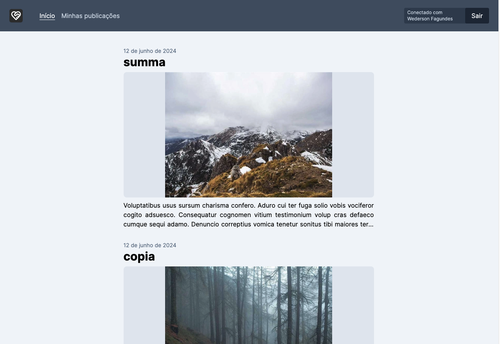
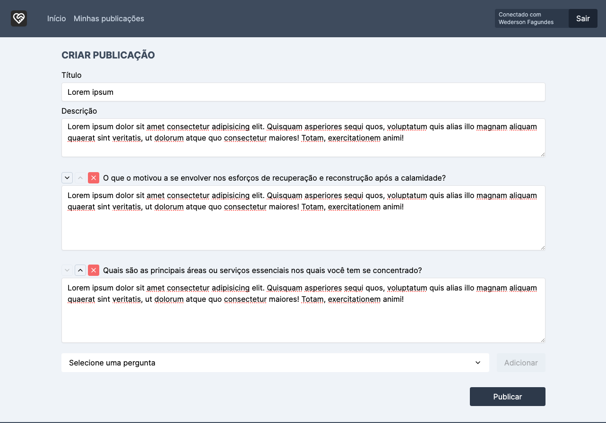
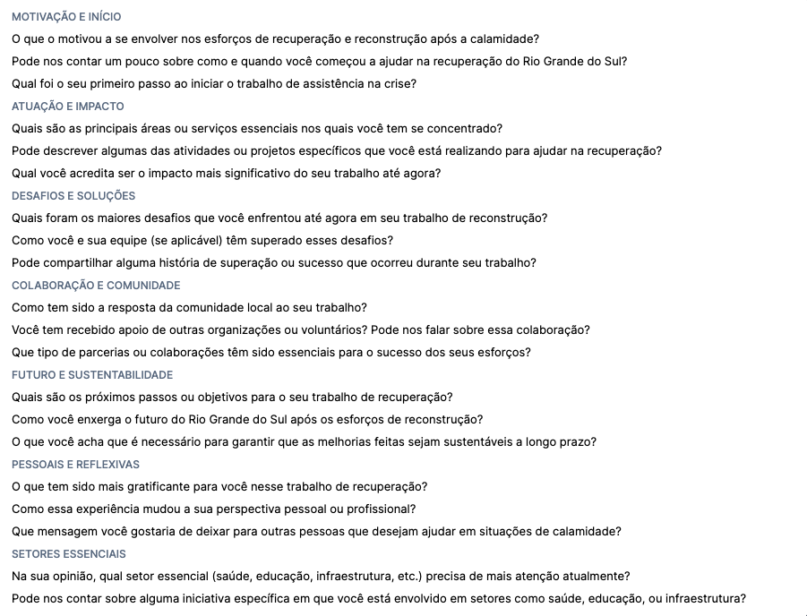

## Projeto: Aplicação para publicações de histórias de voluntários na reconstrução do RS!

**Página inicial**

**Criação de postagem**

**Perguntas padrões**

Acesso: https://herois-anonimos.vercel.app

Repositório original: https://github.com/wedersonf/herois-anonimos

#### Desenvolvedor
Wederson Fagundes, Sistemas de Informação

#### Descrição
O objetivo da aplicação é dar visibilidade para histórias de voluntários que auxiliaram durante as enchentes no RS e aos que estão ajudando na reconstrução do Rio Grande do Sul. Para utilizar basta criar uma conta e publicar os relatos.
A aplicação conta com perguntas pré definidas que podem ser incluídas, visando direcionar com que o conteúdo das publicações postadas sigam o mesmo viés.

#### Desenvolvimento
O foco do projeto foi direcionado no _backend_ visando melhorar meu conhecimento, mas mantendo uma interface simples e de fácil entendimento.

### Acesso de teste
#### Administrador

<strong>E-mail:</strong> john@example.com

<strong>Senha:</strong> 123456

#### Usuário comum
Para acessar como um usuário sem as permissões de administrador, crie uma nova conta.

## Atualizações
<table class="table table-bordered table-hover table-condensed">
  <thead>
    <tr>
      <th">Versão</th>
      <th">Data da entrega</th>
      <th">Funcionalidade/Alterações</th>
    </tr>
  </thead>
  
  <tbody>
  <tr>
    <td align="right">0.1.0</td>
    <td>18/06/2024</td>
    <td>
      <ul>
        <li>Criação de conta para autores;</li>
        <li>Autenticação do autor;</li>
        <li>Criação de novas publicações;</li>
        <li>Listagem de publicações;</li>
        <li>Listagem de publicações por id do author;</li>
        <li>Busca de publicação por slug;</li>
        <li>Busca de publicação por id;</li>
        <li>Remover publicação.</li>
      </ul>
    </td>
  </tr>

  <tr>
    <td align="right">0.1.1</td>
    <td>25/06/2024</td>
    <td>
      <ul>
        <li>Correção dos endpoints da API;</li>
        <li>Edição de publicações;</li>
        <li>Botão para voltar para lista de publicações;</li>
        <li>Paginação da listagem de publicações na tela inicial;</li>
        <li>Carregamento estilo esqueleto na página inicial;</li>
        <li>Carregamento estilo esqueleto na listagem de publicações do autor;</li>
        <li>Incluído botão de voltar para o top quando rolagem estiver ativa.</li>
      </ul>
    </td>
  </tr>

  <tr>
    <td align="right">0.1.2</td>
    <td>02/07/2024</td>
    <td>
      <ul>
        <li>Adicionado endpoint para upload de arquivos na cloudflare;<li>
        <li>Adicionado loader de carregamento na tela de edição de publicações;</li>
        <li>Correção da ordenação das perguntas na postagem;<li>
        <li>Ajustes no arquivo seed para popular banco de dados com imagens de exemplo;</li>
        <li>Adicionado voltar para o início ao clicar na logo;</li>
        <li>Formatação da data da publicação na lista de publicações na página inicial;</li>
        <li>Adicionado nome do autor na listagem de publicações da página inicial;<li>
        <li>Ajustes na largura do conteúdo do cabeçalho e rodapé do site;<li>
        <li>Adicionado página 404 quando inserido uma url invalida.<li>
      </ul>
    <td>
  </tr>

  <tr>
    <td align="right">0.1.3</td>
    <td>09/07/2024</td>
    <td>
      <ul>
        <li>Correção do botão de cancelar no alerta de confirmação de exclusão.</li>
        <li>Ajuste de responsividade de páginas e componentes.</li>
        <li>Adicionado administradores.</li>
        <li>Adicionado menu de gerenciamento.</li>
        <li>Adicionado gerenciamento de publicações.</li>
        <li>Adicionado gerenciamento de usuários.</li>
      </ul>
    </td>
  </tr>

  <tr>
    <td align="right">1.0.0</td>
    <td>16/07/2024</td>
    <td>
      <ul>
        <li>Ajuste das margens na tela de configurações.</li>
        <li>Ajuste de layout para versão de celular.</li>
        <li>Ajuste de alinhamento de texto para esquerda na descrição e respostas das publicações.</li>
        <li>Adicionado gerenciamento de perguntas pré-definidas.</li>
        <li>Alterado a listagem fixa de perguntas ao gerenciar uma publicação, para listagem cadastradas no banco de dados.</li>
        <li>Adicionado loader de carregamento das perguntas na página de criação/edição de publicação.</li>
        <li>Removido arquivo estático com perguntas pré-definidas</li>
        <li>Adicionado a criação das perguntas padrões no 'seed' do banco de dados.</li>
        <li>Adicionado opção de adicionar pergunta personalizada no menu de perguntas na página de criação/edição de publicação.<li>
        <li>Ajuste de estilo do loader de carregamento da página 'minhas publicações'.</li>
        <li>Removido elemento da imagem no card de publicações quando a publicação não tem uma imagem.</li>
        <li>Removida a animação de progresso das mensagens de alerta.</li>
        <li>Deletar publicações e suas respectivas imagens ao deletar usuário.</li>
      </ul>
    </td>
  </tr>
</tbody>
</table>

#### Tecnologias
- ReactJS;
- [Radix UI - Primitives](https://www.radix-ui.com/primitives);
- [TailwindCSS](https://tailwindcss.com/);
- [NextJS](https://nextjs.org);
- [MongoDB](https://www.mongodb.com/).

#### Ambiente de desenvolvimento
- VSCode;
- Docker.

#### Referências e créditos
- [Atlas Docs](https://www.mongodb.com/docs/atlas/).

---
Projeto entregue para a disciplina de [Desenvolvimento de Software para a Web](http://github.com/andreainfufsm/elc1090-2024a) em 2024a.

